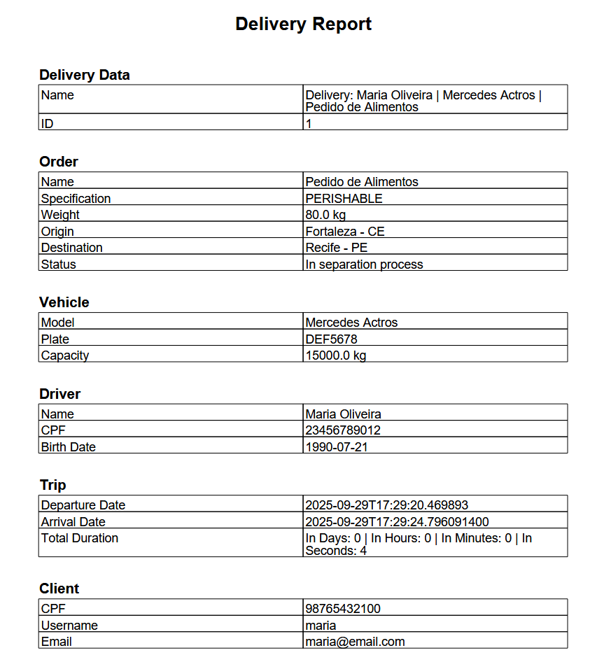

README temporário ⚠️

# 🚚 Projeto de Logística com Spring Boot

## 1. Criação da Frota
Nesta etapa, criamos os **veículos** e **motoristas**, simulando a frota de uma empresa.  

- **Veículos**, além de outros atributos, possuem os seguintes *enums*:  
  - `Availability { RUNNING, MAINTENANCE, AVAILABLE }`  
  - `Specification { TOXIC, PERISHABLE, FRAGILE, ... }`  
  - `Maintenance { LOW, MEDIUM, HIGH }`  

- **Motoristas** possuem os *enums*:  
  - `Specification`  
  - `Situation { ON_ROUTE, UNAVAILABLE, AVAILABLE }`  

---

## 2. Cadastro e Criação de Pedidos (CustomerInteractionService)
Com a frota formada, o cliente pode se cadastrar no serviço **CustomerInteractionService**, ponto de maior contato com o sistema.  

- Após login, o cliente pode criar um **Order**, que possui:  
  - `Specification`  
  - `State { DELIVERED, SHIPPED, BLOCKED, SEPARATION }`  
  - `Route (origin, destiny)`  

📌 Depois que o pedido é criado, a responsabilidade passa para o **administrador**, que deve despachá-lo informando o **ID do pedido**.  

---

## 3. Associação de Entrega (AssociationService)
Após o pedido ser despachado, entra em ação o **serviço de associação**, responsável por criar o objeto **Delivery**, que representa a associação entre **Motorista, Veículo e Pedido**.  

- Busca motoristas com a especificação compatível e situação **AVAILABLE**.  
- Busca veículos com disponibilidade **AVAILABLE**.  
- Utiliza a API do **Google Maps** para calcular o tempo médio de trajeto (`originCep → destinyCep`):  
  - Se tempo **> 15 horas** → veículo com `Maintenance.LOW`.  
  - Caso contrário → veículo com `Maintenance.MEDIUM`.  
- Se não houver motorista ou veículo compatível → retorna **erro de associação**.  

### Caso associação seja possível:
- Motorista → `ON_ROUTE`  
- Veículo → `RUNNING`  
- Criação de **DeliveryToCommunicationDTO** contendo:  
  - `VehicleToSyncDTO`  
  - `DriverToSyncDTO`  
  - `OrderDTO`  
  - `TripDTO` (com `departureDate` atribuído no construtor)  

➡️ Objeto enviado ao **DeliveryRepositoryService** para persistência.  

---

## 4. Persistência e Relatório (ReportService)
O **DeliveryToCommunicationDTO** é persistido no banco como **Delivery**, entidade com os seguintes atributos identificadores únicos:  
- `vehiclePlate`  
- `orderId`  
- `driverCpf`  

### Fluxo de Finalização:
1. O administrador confirma a entrega chamando o endpoint com o **ID do delivery**.  
2. O sistema registra a **data de chegada**.  
3. O objeto atualizado é enviado ao **ReportService**, que gera um **relatório em PDF**.  

### Antes de gerar o PDF, o serviço:
- Consulta o **FleetService** para obter motorista e veículo pelos identificadores (`plate` e `cpf`).  
- Consulta o **OrderService** para obter o pedido pelo `orderId`.  
- Atualiza o estado do pedido para **DELIVERED** via **CustomerInteractionClient**.  

✅ Por fim, retorna o **PDF** com todas as informações consolidadas.  

---